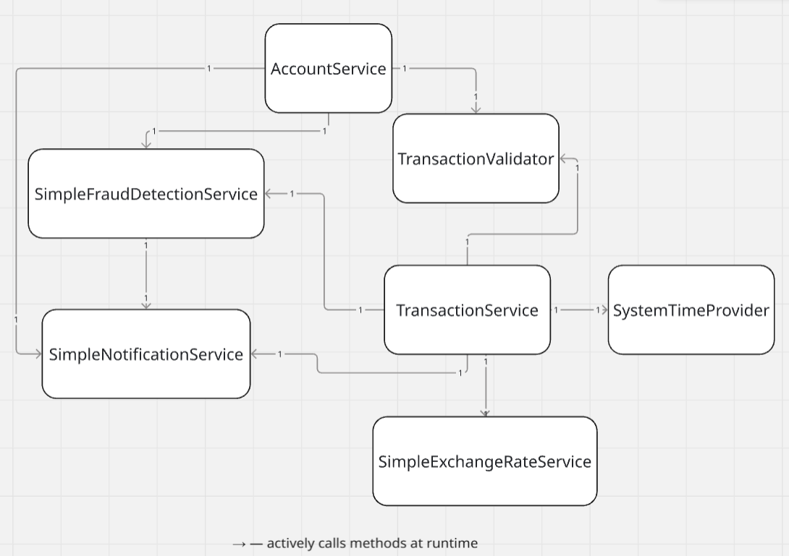

# Unit Tests: Core System

This is core codebase for modules [1-1-unit-test-refactor](../1-1-unit-test-refactor) and [1-2-unit-test-scratch](../1-2-unit-test-scratch)

## System Overview

A simple banking system that demonstrates core financial operations:
account management, deposits, withdrawals, transfers, interest calculation,
and fraud detection. Your task is to write unit tests for this system.

## Class Diagram

> `→` solid line — actively calls methods at runtime

## System Components

### Models
- **Account** - bank account with balance, currency, status and daily withdrawal limit
- **Transaction** - financial operation record (deposit, withdrawal, transfer)
- **Client** - bank customer

### Services
- **AccountService** - account lifecycle management: create, deposit, withdraw, block, close
- **TransactionService** - transaction processing: transfer between accounts, deposit, withdrawal with transaction recording
- **TransactionValidator** - validates business rules before any transaction
- **InterestCalculator** - calculates simple and compound interest for accounts
- **SimpleExchangeRateService** - currency conversion between USD, EUR, UAH
- **SimpleFraudDetectionService** - detects suspicious transactions based on amount thresholds

### Utilities
- **FixedTimeProvider** - deterministic time provider for testing (instead of `LocalDateTime.now()`)
- **SystemTimeProvider** - real system time for production use
